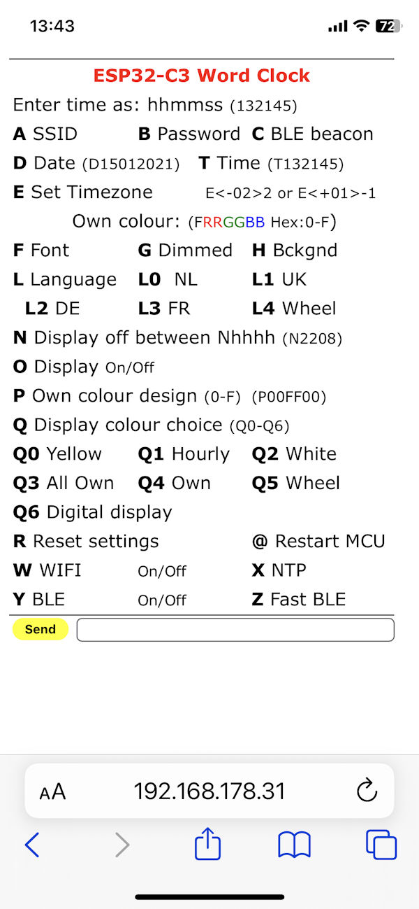
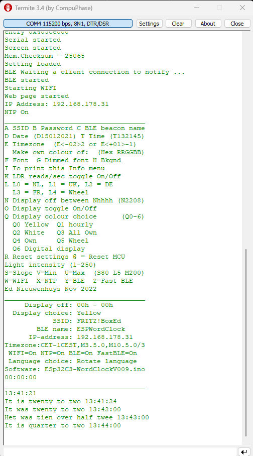
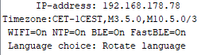
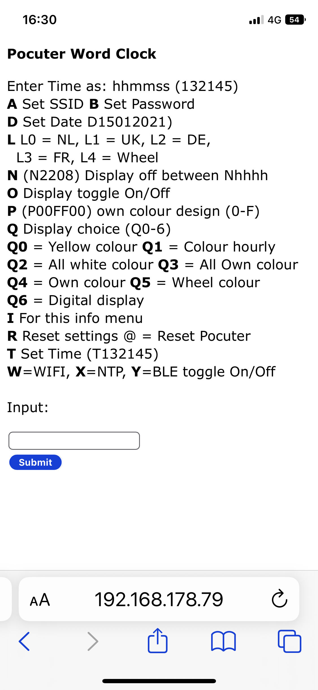
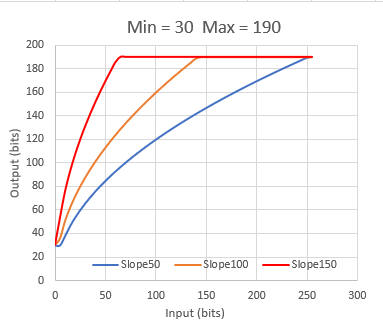
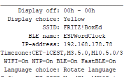
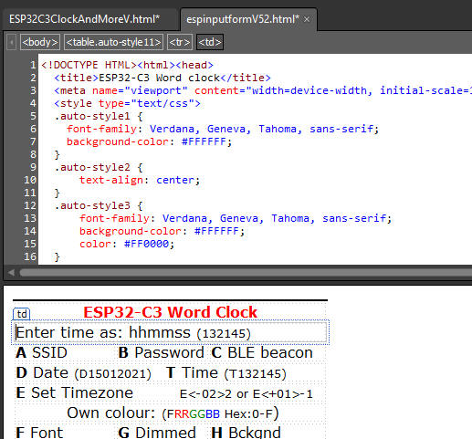

# Arduino-ESP32-Nano-Word clock

Built your own word clock with one or four languages with an Arduino ESP32 Nano. 
You can control it with your phone of with a web page. 
Software updates can be uploaded with OTA (Over the Air). 
It will keep its time within the second correct with the internet NTP time and a time zone selection. 
If no internet is available a DS3231 RTC module can be attached to get an accurate time. With a rotary or membrane pad the time can be set. 
A LDR is used to give the LED an optimal brightness. 
A DCF77 time receiver can be attached to receive the time from the air in the EU. 

A PCB with shift registers for white LED clocks and for use with RGB(W) LED strips [with the Arduino Nano ESP32 here.](https://github.com/ednieuw/NanoESP32-BW-RGBW-clock)

[Manual_ArduinoESP32Nano.pdf](https://github.com/ednieuw/Arduino-ESP32-Nano-Wordclock/blob/main/Manual_ArduinoESP32Nano.pdf)

If you have a ILI9341 display [have a look here](https://github.com/ednieuw/ESP32-C3-Clock-and-more) for an alternative word clock.

Do you happen to have a €50 LilyGo watch looking like a iWatch have [a look here](https://github.com/ednieuw/Lilygo-T-Watch-2020)

But you can also not built a word clock and use the software to control SK6812 or WS2812 LEDs with your phone with Bluetooth or a web page.

The Arduino Nano word clocks from my older projects, https://github.com/ednieuw/Word-Colour-Clock-SK6812-WS2812, must have a DS3231 RTC and a Bluetooth module attached to get and keep the time.

The Arduino Nano ESP32 can receive its time with WIFI from the internet and has an built-in RTC module. 

The older Arduino MKR1000, Nano BLE 33 and all its variants with Bluetooth and WIFI has the disadvantage that only WIFI or BLE could be used. The ESP32 has an Espressif BLE/WIFI module. Bluetooth LE does not use the TI CC2541 chip but a Nordic nRF52 chip. 
That means you have to use a different BLE service for the serial communication. Not FFE0 but 6e400001-b5a3-... et cetera in your serial terminal app that is used to communicate with the settings of the clock software. Depending on the app you use you probably must specify which protocol to use.

See here: [Use BLE on mobile to control the ESP32](https://github.com/ednieuw/nRF-ESP32)

Due to the fact that the ESP32-S3 chip used in the Nano ESP32 has many more ports and a different port numbering as the ATMEGA chips Arduino had to change the pin numbering in the software. 

At the moment of writing the Espressif ESP32 board V3.0.4 with the Arduino Nano ESP32 selected does not compile to a working program. 
Select the Nano ESP32 board from Arduino. The difference is easy to see; if there is only one board to select from it is right, if there is a very long list of MCU's to select from it is wrong.

There are two compiler pin numbering methods: One method uses the GPIO numbering of the ESP32-S3 or by Arduino pin numbering. 
This code must be compiled with GPIO numbering selected. If the LEDs do not turn on check this GPIO numbering setting.

When the Arduino macro numbering D1, D2, ... , D13 is used for digital pins and A0, A1, .. A7 for the analogue pins and LED_BUILTIN, LED_RED LED_GREEN, LED_BLUE for the LEDs on the Nano ESP32 board 'GPIO numbering' must be selected in the compiler. 

For my clocks I use a [Fritzing software](https://fritzing.org/) designed PCB. This is easy to use and it can export Gerber files that can be send to companies that print PCB's. You can also order a PCB with the Fritzing app itself.

[PCBWay](https://www.pcbway.com/) can also print 10 PCB's for $5. With +/-$25 shipping and custom charges this is very cheap. The PCB were received within a week after ordering and the quality was excellent. Just upload the Gerber files in the ZIP-file and pay the charges.  

The PCB design file can be found in this repository or here:  [ESP32 PCB](https://github.com/ednieuw/NanoESP32PCB)

The PCB can connect to a rotary encoder, a DS3231 RTC module or other I2C device, a DCF77-receiver module or other device that receives pulses and a LDR to measure light intensity to control the brightness of the LED-strip.

The SK6812 RGBW LED-strip operates at 5V. De data signal from the Nano is 3.3V. 

I tried to use optocouplers to amplify the data signal from 3.3V to 5V but failed. see here: 
https://ednieuw.home.xs4all.nl/ElecProj/OptoSK6812/OptocouplerSK6812.html

For level switching the 74HCT125 level shifter is used. It has four ports and I adapted the design of the PCB it can use the other three ports on the IC for other uses. 

But the SK6812 RGBW strip, with 14 LEDs, also happily worked when the data line was connected directly to the 3.3V data line of the Nano ESP32. I have not tested strips with more LEDs in the strip.

The lesson of this story is that you can connect the SK6812 RGBW strip with a 470 ohm resistor in the data line and a 200 - 1000 uF capacitor over the 5V and GND directly to the strip without the use of a level shifter.  But success is not guaranteed.

 

A universal PCB to drive RGB(W) LEDs and /or white 2835 LED strips with shift registers can be found here: [Nano  ESP32 RGBW BW PCB](https://github.com/ednieuw/NanoESP32-BW-RGBW-clock)  
One PCB, with one Arduino source code, will support the colour LED clocks and the white LED clocks run with a Arduino Nano ES32. 

A powerful 5V power supply for the LEDs. Power can be drawn from the VBUS-pin (5V USB) on the Nano if the Nano is powered with a USB-C cable.  
VBUS provides 5V whenever powered via USB. If powered via the VIN pin, it is disabled. This means that while powering the board through the VIN pin, you can't get 5V from the board. 

The PCB can use different power connection options.
A 5V, >1A power supply can be attached at the 5V power connection on the top left of the PCB.

If the red line shortcut (see picture below) is closed then the LED-strip is powered via the Power 6-21V (VIN) connection with 5V. 

This will also power the Nano ESP32. You can connect the Vin on the ESP32 Nano with a 5V USB power supply although the minimum voltage is noted as 6V. the 1N5817 diode even lowers the voltage with 0.5V to 4.5V. 

BUT KEEP IN MIND. This 5V connection is fed to the LED-strip directly. If a higher voltage power supply us connected the LEDs will be destroyed but Nano will turn on happily. 

If the Nano ESP32 is connected via the USB-C port then the yellow connection must be shortcut. The LEDs will be powered by this power source. This is fine with 20 LEDs but probably not for longer strips.

After connections are made the PCB and hardware looks like this

# Software

The ESP32Arduino_WordClockVxxx.ino  turns the Nano ESP32 and SK6812 or WS2812 LED strips into a Word clock with connection to your WIFI router and receives the time from a NTP server.

The software can be controlled via Bluetooth on your Android or iPhone/iPad/iMac.

There are for the 144 LED clock four languages to select or make a four-language clock that displays four languages at once with it 625 LEDs. 

If you have a word plate ofcourse. [Word clock with SK6812 LEDs in NL, DE, FR.](https://github.com/ednieuw/FourLanguageClock)

The software can be used with SK6812 or WS2812 LED-strips. 
With a little programming experience it is not difficult to change the clock to a single French, German or English design.

Or a [single language clock](https://github.com/ednieuw/Woordklok-witte-LEDs)

In the libraries.zip are the libraries to compile the software. Unpack them in you libraries folder. 
Download the program folder and compile for Arduino Nano ESP32 

# How to compile: 
Install Arduino Nano ESP32 board 
Board: Arduino Nano ESP32 
Partition Scheme: With FAT 
<strong> Pin Numbering: By GPIO number (legacy)  !! change this </strong> 
The LEDs will not turn on when you use the "Arduino default pin settings" due to a bug in the Adafruit Neopixel library

# Before starting

The clock receives time from the internet if a DS3231 time module is not installed. 

When a DS3231 time module is attached to the circuit board an internet connection is not obliged.

To connect to the internet the name of the WIFI station and its password must be entered in the clock software to be able to connect to a WIFI router.

The name of the WIFI-station and password has to be entered once. These credentials will be stored in memory of the microprocessor.

To make life easy it is preferred to use a phone or tablet and a Bluetooth communication app to enter the WIFI credentials into the clock.

 	 	 
BLESerial nRF	BLE Serial Pro	Serial Bluetooth Terminal
- Download a Bluetooth UART serial terminal app on your phone, PC, or tablet. 

- For IOS iPhone or iPad: [BLE Serial Pro](https://apps.apple.com/nl/app/ble-serial-pro/id1632245655?l=en).  
Or the free less sophisticated app: [BLE serial nRF](https://apps.apple.com/nl/app/bleserial-nrf/id1632235163?l). 
Tip: Turn on Fast BLE with option Z in the menu for a faster transmission.

- For Android use: [Serial Bluetooth terminal](https://play.google.com/store/apps/details?id=de.kai_morich.serial_bluetooth_terminal).  
Do not turn on Fast BLE in the menu. (Off = default)

# Control of the clock
If the clock is connected to the internet it will seek contact with a time server. (NTP connection can be turned off in the menu).

The time zone is set to UTC+1 Amsterdam but can be changed in the menu.  
To connect to a WIFI network a SSID and password must be entered. 
 
There are a few methods:  
1. Connect the MCU with a serial cable to a PC and use a serial terminal.

I use the Arduino IDE or <a href="https://www.compuphase.com/software_termite.htm"> Termite</a> as serial terminal. 

Sending the character 'I' for information will display the menu followed with the actual settings of several preferences. 

<table style="width: 51%"><tr>
<td style="width: 342px">
</td>
<td style="width: 415px">
</td>
</tr>

<tr>
<td style="width: 342px" >HTML page on iPhone.</td>
<td style="width: 415px"> 
 Termite Terminal on a PC </td>
</tr>
</table>
 

2. USE the BLE nRF connection with an UART serial terminal app to control it with your mobile phone or tablet. 

Use the IOS app for iPhone or iPad: <a href="https://apps.apple.com/nl/app/ble-serial-pro/id1632245655?l=en">BLE Serial Pro</a>.  
or the free app BLEserial nRF: https://apps.apple.com/nl/app/bleserial-nrf/id1632235163?l=en-GB
Turn on Fast BLE with option Z in the menu. 

For Android use:<a href="https://play.google.com/store/apps/details?id=de.kai_morich.serial_bluetooth_terminal">Serial Bluetooth terminal</a>.  
Turn off (default) Fast BLE in the menu. 

Start the app and find the MCU in the list of devices and connect to it. You can change it's beacon name in the menu with option C. 

In both cases send the character I of Information and the menu shows up. 
Enter the first character of the setting you want to change followed with a code.  
Some entries just toggle On and Off. Like the W to set WIFI Off or On. 
  

 To change the SSID and password:  
Amy-ssid and send this command. Eg AFRITZ!Box01 or aFRITZ!Box01. 
Starting with an upper or lower case character is an identical instruction in the command string  
Then Bmy-passwordand send the password.(for example: bSecret 
 
Cbroadcastname will change to name displayed in the Bluetooth connection list.  
If the length of the SSID and/or password is less then 5 characters the WIFI will be turned off automatically. This will speed up startup time if no internet connection is available  
Use a length of minimal 8 characters for SSID and password.  
Check in the menu (third row from the bottom) if WIFI and NTP are on.  
If WIFI is connected the LED on the MCU will pulse green.  
  Enter @ to reset the MCU. It will restart and connections will be made.  
 
To set a time zone. Send the time zone string between the quotes prefixed with the character E or e.  
See the time zones at the bottom of this page.  
For example; if you live in Australia/Sydney send the string: eAEST-10AEDT,M10.1.0,M4.1.0/3 

<pre>______________________________
A SSID B Password C BLE beacon name
D Date (D15012021) T Time (T132145)
E Timezone  (E<-02>2 or E<+01>-1)
F Own colour  (Hex FWWRRGGBB)
I To print this Info menu
J Toggle use DS3231 RTC module
K LDR reads/sec toggle On/Off
N Display off between Nhhhh (N2208)
O Display toggle On/Off
P Status LED toggle On/Off
Q Display colour choice      (Q0-7)
  Q0 Yellow  Q1 hourly
  Q2 White   Q3 All Own
  Q4 Own     Q5 Wheel
R Reset settings @ = Reset MCU
--Light intensity settings (1-250)--
S=Slope V=Min  U=Max   (S80 V5 U200)
W=WIFI  X=NTP& Y=BLE  Z=Fast BLE
Ed Nieuwenhuys Juni 2024
___________________________________
Display off between: 23h - 08h
Display choice: Wheel
Slope: 20     Min: 5     Max: 255 
SSID: FRITZ!Box
BLE name: NanoESP32Clock
IP-address: 192.168.178.34 (/update)
Timezone:CET-1CEST,M3.5.0,M10.5.0/3
WIFI=On NTP=On BLE=On FastBLE=On
Language choice: NL
LED strip: WS2812 (Send % to switch)
Software: ESP32Arduino_WordClockV026.ino
______________________________________________________________________
</pre>

Menu shown in serial output.

If no WIFI is not used check at the bottom of the menu if WIFI is OFF. 
The clock will start much quicker because it will not try to connect.  

As mentioned before the clock can be controlled with the WIFI webpage or BLE UART terminal app.  
When the clock is connected to WIFI the IP-address is displayed in the Digital display.  
Enter this IP-address numbers and dots (for example: 192.168.178.31) in the browser of your mobile or PC where you type 
your internet addresses (URL). 

Or 
Open the BLE terminal app. Look for the WordClock to connect to and connect.

for Apple IOS devices BLE connection can be made with my app <a href="https://ednieuw.home.xs4all.nl/BLESerial/BLESerialPRO.html"> BLE Serial pro </a> on the <a href="https://apps.apple.com/nl/app/ble-serial-pro/id1632245655?l=en">app store</a> . 

For Android <a href="https://play.google.com/store/apps/details?id=com.nordicsemi.nrfUARTv2&amp;hl=en&amp;gl=US"> 
&nbsp;nRF UART terminal program </a>and <a href="https://play.google.com/store/apps/details?id=de.kai_morich.serial_bluetooth_terminal">
Serial Bluetooth terminal</a>.  
Unfortunately these Android apps can not read strings longer than 20 characters.  
If you see a garbled menu enter and send the character 'Z' to select the slower transmission mode. 
 
Settings are set by entering the first character of a command following by parameters if necessary.  
For example to set the colours of the characters in the display to white enter: Q2  
 
 To shown random all four languages every minute send L4.  
 
 Set the time by entering T130245. (130245 will also work)  
 
 Turn off WIFI by sending a W. 

Reset the MCU with the character @. 
Reset to default setting by send R.  
 In the BLE connection the SSID and password will be shown.   
	
<table cellspacing="6" style="width: auto">
<tr>
<td style="width: 318px">
</td>
<td>
</td>
</tr>
<tr>
<td style="width: 318px" >HTML page</td>
<td >BLE menu</td>
</tr>
</table>

# Detailed description
<pre>______________________________
A SSID B Password C BLE beacon name
D Date (D15012021) T Time (T132145)
E Timezone  (E<-02>2 or E<+01>-1)
F Own colour  (Hex FWWRRGGBB)
I To print this Info menu
J Toggle use DS3231 RTC module
K LDR reads/sec toggle On/Off
N Display off between Nhhhh (N2208)
O Display toggle On/Off
P Status LED toggle On/Off
Q Display colour choice      (Q0-7)
  Q0 Yellow  Q1 hourly
  Q2 White   Q3 All Own
  Q4 Own     Q5 Wheel
R Reset settings @ = Reset MCU
--Light intensity settings (1-250)--
S=Slope V=Min  U=Max   (S80 V5 U200)
W=WIFI  X=NTP& Y=BLE  Z=Fast BLE
Ed Nieuwenhuys Juni 2024
___________________________________
Display off between: 23h - 08h
Display choice: Wheel
Slope: 20     Min: 5     Max: 255 
SSID: FRITZ!Box
BLE name: NanoESP32Clock
IP-address: 192.168.178.34 (/update)
Timezone:CET-1CEST,M3.5.0,M10.5.0/3
WIFI=On NTP=On BLE=On FastBLE=On
Language choice: NL
LED strip: WS2812 (Send % to switch)
Software: ESP32Arduino_WordClockV026.ino
___________________________________</pre>

 With the menu many preferences can be set.  
These preferences are permanently stored in the ESP32-S3 SPIFFS-storage space. 

Enter the first character in the menu of the item to be changed followed with the parameter.  
For most entries upper and lower case are identical. 

# A SSID B Password C BLE beacon name 
Change the name of the SSID of the router to be connected to. 
aFRITZ!BoxEd or AFRITZ!BoxEd  
Then enter the password. For example: BSecret_pass  
Restart the MCU by sending @.  
Entering a single 'b' will show the used password. This Easter egg can can used to check if a valid password was entered.

# D Set Date and T Set Time  
If you are not connected to WIFI you have to set the time and date by hand.  
For example enter: D06112022 to set the date to 6 November 2022.   
Enter for example T132145 (or 132145 , or t132145)&nbsp; to set the time to 45 seconds and 21 minutes past one o'clock.

# E Set Timezone E&lt;-02&gt;2 or E&lt;+01&gt;-1 
At the bottom of this page you can find the time zones used in 2022.   
It is a rather complicated string and it is therefore wise to copy it.  
Let's pick one if you happen to live here: Antarctica/Troll,"&lt;+00&gt;0&lt;+02&gt;-2,M3.5.0/1,M10.5.0/3"  
Copy the string between the " " 's and send it starting with an 'E' or 'e' in front.  
E&lt;+00&gt;0&lt;+02&gt;-2,M3.5.0/1,M10.5.0/3 

# F Own colour  (Hex FWWRRGGBB  
ou can set the colours of the highlighted and dimmed characters and&nbsp;the background.  
ime is shown with the colour defined when Display choice Q3 or Q4 is chosen and the rest of the not highlighted characters are coloured ith the settings from Dimmed font.  
The format to be entered is hexadecimal. 0123456789ABCDEF are the character that can be used.  
The command is 2 digits for Red followed with&nbsp;two digits for Green and ending with two digits for Blue. 
To colour the characters intense red enter FF0000 prefixed with the character F, G or H.  
To set the background to intense blue enter: H0000FF  
To set the dimmed character to dark gray enter for example: G191919.  
You get gray if red, green and blue has the same intensity.

# I To print this Info menu 
Print the menu to Bluetooth and the serial monitor when connected with an USB-cable. 

# K LDR reads/sec toggle On/Off 
Prints the LDR-readings and the calculated intensity output.

# N Display off between Nhhhh (N2208) 
With N2208 the display will be turned off between 22:00 and 08:00. 

# O Display toggle On/Off 
 O toggles the display off and on.
 
#  Q Display colour choice (Q0-6) 
Q0 Yellow Q1 hourly Q2 White Q3 All Own Q4 Own Q5 Wheel Q6 Digital display  
Q0 will show the time with yellow words.  
Q1 will show every hour another colour.  
Q2 shows all the texts white.  
Q3 and Q4 uses you own defined colours.  
Q5 will follow rainbow colours every minute.  
Q6 is the digital display with the IP-address and date until seconds are 00.  
The selected choice is displayed at the bottom of the menu.  
Send an 'I' to display the latest's settings 

# R Reset settings  
R will set all preferences to default settings and clears the SSID and password. 

# Light intensity (1-250)
S=Slope V=Min&nbsp; U=Max (S100 L5 M200)

<table style="width: 100%">
<tr>
<td> To control the light intensity three parameters can be set.  
The values ranges between 0 and 255.  
The minimal light intensity is to avoid that the display turns completely off when it is dark.  
It also prevents flickering when the input value are very low, like 2 and 3 bits.  
Values ranging between 5 and 20 are suggested. When no LDR is attached the Min value can be set to 255. 
The maximum light intensity is 255 bits for 100% intensity.   
The Slope (sensitivity) controls the speed at with the maximum value is reached.  
It multiplies the reading as a percentage. So, entering 100 is a multiplication by one.  
The placement and sensitivity of your LDR can be adjusted with this parameter Slope. </td>
<td> 
 
The effect of the value of the slope on the light intensity of the LEDs 
or display. </td>
</tr>
</table>

<table style="width: 100%">
	<tr>
		<td> 
		# @ = Restart MCU 
		@ will restart the MCU. This is handy when the SSID, password, et cetera are 
changed and the program must be restarted.#  
		 
		W=WIFI, X=NTP, Y=BLE 
		Toggle WIFI, NTP and BLE on and off. 
		Sending the character will toggle it on or off.  
		At the bottom of the menu the 
state is printed. 
		 </td>
		<td>
</td>
	</tr>
	<tr>
		<td colspan="2">

# Z Fast BLE 
The BLE UART protocol sends default packets of 20 bytes. Between every packet there is a delay of 50 msec  
The IOS BLEserial app, and maybe others too, is able to receive packets of 80 bytes or more before characters are missed.  With most apps you will see these will truncate the long strings of the menu. 
Then turn off Fast BLE.  
Option Z toggles between the long and short packages.&nbsp; 
Settings are stored in the SPIFFS space from the Arduino Nano ESP32
</td>
</tr>
</table>

# Compilation and uploading

The settings of the Arduino Nano ESP32 board is as follows. 
Remember to install the ESP32 boards as explained above in the chapter Materials 

&nbsp;

# Program explanation
 The program uses the following standard libraries.   
 
<pre>// ESP32-S3 Includes defines and initialisations 

#include <NimBLEDevice.h>        // For BLE communication  https://github.com/h2zero/NimBLE-Arduino
#include <ESPNtpClient.h>        // https://github.com/gmag11/ESPNtpClient
#include <WiFi.h>                // Used for web page 
#include <AsyncTCP.h>            // Used for webpage   https://github.com/me-no-dev/ESPAsyncWebServer
#include <ESPAsyncWebServer.h>   // Used for webpage   https://github.com/me-no-dev/ESPAsyncWebServer
#include <ElegantOTA.h>          // Used for OTA new version
#include <Preferences.h>
#include "Colors.h"
#include <Adafruit_NeoPixel.h>   // https://github.com/adafruit/Adafruit_NeoPixel   for LED strip WS2812 or SK6812
</pre>
 Colors.h is included in the program as a TAB in the IDE. It contains color names and it associated RGB values  
 The other TAB is the web page to display in the browser. 
The&nbsp;#include "Webpage.h" to load the webpage is a few lines further in the code  
  
I made the web page in the free 'Microsoft Expression Web 4'. It is not maintained anymore but has more than enough functionalities for our purposes. 
 
To copy the code from the MS-Expression:  
 In the bottom line of the window of MS-Expression click&nbsp;'Split'. 
In the upper half the raw HTML Code is displayed and in the bottom half the 
Design window. 
Copy in the Code window all the HTML code  
Go to the Arduino IDE and paste it in the webpage.h TAB between:  
R"rawliteral(   &nbsp;... and ...&nbsp;
 )rawliteral"; 
 
  Or copy the the code from the webpage.h into 
MSexpression Code area and redesign the page as you like 

 
 &nbsp; 
 A long list if definitions and initialisations follows.  
 I am not a fan of passing all the variables to and from functions and like to 
keep them global in one program list.  
 If you write a program with other people it is good practice not to use 
too many globals 
but this program is in one large listing, for the same reason to keep it simple.  
 I grouped all the variables per application to keep track where they are used.  
 With a simple find it is easy in this one great listing to find the back. 
 
To print the time as text and colour with the proper LEDs or characters, the 
words and its position in a string of LEDs or text are defined.  
The defines executes the function ColorLeds with its proper parameters. 
Further in the program&nbsp; in the function void Dutch(void), void 
English(void) et cetera it becomes clear why these defines are so useful and 
handy.&nbsp;  

<pre> ...   
 #define PRECIES ColorLeds("precies", 16, 22, LetterColor);
#define MTIEN   ColorLeds("tien", 25, 28, LetterColor); 
#define KWART   ColorLeds("kwart", 32, 36, LetterColor); 
#define VOOR    ColorLeds("voor", 38, 41, LetterColor); 
... 
</pre>
 This is the initialisation of the storage area to 
store the struct EEPROMstorage. 
The Struct with all its settings is saved in one command to permanent memory or SD  
Preferences FLASHSTOR;  
 

struct EEPROMstorage { // Data storage in EEPROM to maintain them after power loss  
byte DisplayChoice = 0;  
...  
char BLEbroadcastName[30]; // Name of the BLE beacon  
char Timezone[50];  
int Checksum = 0;  
} Mem;  
  
  The variables are adressed with a short name Mem.
   For example Mem.DisplayChoice = 3;  
 
 The Struct EEPROMstorage 
 is stored in the function StoreStructInFlashMemory  and retrieved in the function GetStructFromFlashMemory  
 
  
 The menu displayed in the serial monitor and BLE app is defined here. String may not be longer than 40 characters what can be checked with the 'ruler'
 
string.  
<pre>// Menu 
//0        1         2         3         4 
//1234567890123456789012345678901234567890  
char menu[][40] = { 
"A SSID B Password C BLE beacon name", 
"D Date (D15012021) T Time (T132145)", 
... 
"W=WIFI, X=NTP, Y=BLE, Z=Fast BLE",  
"Nov 2022" }; </pre>
 The Setup happens here: <pre>//-------------------------------------------- 
// ESP32-C3 Setup 
//-------------------------------------------- 
void setup()  
{
Serial.begin(115200); Tekstprintln("Serial started"); // Setup the serial port to 115200 baud // 
...
... 
msTick = LastButtonTime = millis();  
}</pre>
  
The loop is kept almost empty and the program starts 
in Every SeccondCheck. 
There is nothing in this program that should be executes every millisecond or 
less <pre>//-------------------------------------------- 
// ESP32-C3 Loop 
//-------------------------------------------- 
void loop()  
{
EverySecondCheck();
}  </pre>
 The following routines check if 
something must happen every second, minute, hour and day. 
This flow handling of the program keeps the processor for 99% free for other 
uses. 
In this program that is almost nothing but for other purposes this can be 
needed. 
Use delays very sparsely.  
In the Bluetooth and Serial communication functions some short delays are used 
that are essential  
here but the program only runs here when there is an actual&nbsp; communication. 
(An alternative method could have been the use of an interrupt every second and 
an empty loop) 
 
Writing or reading to ports consumes a lot of processor time 
To let the LEDs flash like a heartbeat. 
With %100==0 the port is written every 100 msec. 
The LEDs are very bright therefore only a maximum of 12 bits of the 255 are send 
to the LED. 

<pre>//-------------------------------------------- 
// CLOCK Update routine done every second 
//-------------------------------------------- 
void EverySecondCheck(void) 
{
static int lumi=0;
(msLeap&gt;500?lumi=(1000-msLeap)/40:lumi=msLeap/40);                       
if (msLeap%100==0){ SetStatusLED(-1,-1,12-lumi,lumi*WIFIConnected,-1); }  
...  
if (timeinfo.tm_min != lastminute) EveryMinuteUpdate(); // Enter the every minute routine after one minute 
... 
}
//-------------------------------------------- 
// CLOCK Update routine done every minute 
//--------------------------------------------  
void EveryMinuteUpdate(void) 
{
... 
if(timeinfo.tm_hour != lasthour) EveryHourUpdate(); 
}
//-------------------------------------------- 
// CLOCK Update routine done every hour 
//-------------------------------------------- 
void EveryHourUpdate(void) 
{
... 
if (timeinfo.tm_mday != lastday) EveryDayUpdate();  
}
// // 
//------------------------------------------------------------------------------ 
// CLOCK Update routine done every day 
//------------------------------------------------------------------------------ 
void EveryDayUpdate(void) 
{
... 
}</pre>
 
 Check for serial input from the serial monitor and 
pass the command to ReworkInputString()&nbsp;  
<pre>//-------------------------------------------- 
// Common check for serial input 
//-------------------------------------------- 
void SerialCheck(void) 
{
... 
ReworkInputString(SerialString+"\n"); // Rework ReworkInputString(); 
... 
}</pre>
  Restore all the default 
values. <pre>//------------------------------------------------------------------------------ 
// Common Reset to default settings 
//------------------------------------------------------------------------------ 
void Reset(void) 
{
Mem.Checksum = 25065;
...
 }</pre>
 Common common print routines. 
To keep all the print commands in one places it is easy to change these routines 
for other boards with a different 'slang'.  
<pre>//-------------------------------------------- 
// Common common print routines 
//-------------------------------------------- 
void Tekstprint(char const tekst[]) { if(Serial) Serial.print(tekst); SendMessageBLE(tekst);sptext[0]=0; }  
void Tekstprintln(char const tekst[]) { sprintf(sptext,"%s\n",tekst); Tekstprint(sptext); } 
void TekstSprint(char const tekst[]) { printf(tekst); sptext[0]=0;} // printing for Debugging purposes in serial monitor  
void TekstSprintln(char const tekst[]){ sprintf(sptext,"%s\n",tekst); TekstSprint(sptext); } 
//------------------------------------------------------------------------------ 
// Common Constrain a string with integers 
// The value between the first and last character in a string is returned between the low and up bounderies 
//------------------------------------------------------------------------------ 
int SConstrainInt(String s,byte first,byte last,int low,int up){return constrain(s.substring(first, last).toInt(), low, up);} 
int SConstrainInt(String s,byte first, int low,int up){return constrain(s.substring(first).toInt(), low, up);} 

</pre>
 The setup of storage space and control of the 
validity of the settings. 
In the checksum is invalid a reset() will restore the default settings <pre>//-------------------------------------------- 
// Common Init and check contents of EEPROM 
//-------------------------------------------- 
void InitStorage(void) </pre>
 Store and retrieve the settings from SPIFFS or SD or 
EEPROM 
the several possibilities are store here. EEPROM becomes outdated but still 
works. <pre>-------------------------------------------- 
// COMMON Store mem.struct in FlashStorage or SD 
//-------------------------------------------- 
void StoreStructInFlashMemory(void) 
{
}
//-------------------------------------------- 
// COMMON Get data from FlashStorage Preferences.h 
//-------------------------------------------- 
void GetStructFromFlashMemory(void) 
{
}</pre>
 Get the commands from the strings entered in the 
serial monitor, Bluetooth or the webpage 
and perform the command in an action. 
The menu letters are almost used but it possible to distinguish between lower 
and uppercase when more commands are needed. 
(That is why there is no conversion to UpperCase or LowerCase). <pre>/-------------------------------------------- 
// CLOCK Input from Bluetooth or Serial 
//-------------------------------------------- 
void ReworkInputString(String InputString) 
{
....  
switch (InputString[0]) 
{
case 'A': 
case 'a':  
if (InputString.length() &gt;5 ) 
... </pre>
 Read the LDR and divide it with 16 to get the values 
from 0 - 4096 between 0 and 255. 
Not all boards has a 12 bit AD converter like.  
<pre>//-------------------------------------------- 
// LDR reading are between 0 and 255.  
// ESP32 analogue read is between 0 - 4096 --   is: 4096 / 8 
//-------------------------------------------- 
int ReadLDR(void) {  return analogRead(PhotoCellPin)/16;} </pre>
 
 Control the color and intensity of the LED on the 
boards in one command  
<pre>//--------------------------------------------
// CLOCK Control the LEDs on the ESP32 
// 0 Low is LED off. Therefore the value is inversed with the ! Not 
//-------------------------------------------- 
void SetStatusLED(bool Red, bool Green, bool Blue) 
{</pre>
 
 This function reads the analog port and calculates an 
output intensity to a 
display or LED-strip 
The readings are squared to get a hyperbolic curve that resembles you eye 
correction for dark and light better than a linear range 
It works wonderfully well. 
  
<pre>//--------------------------------------------  
// LED Dim the leds measured by the LDR and print values  
// LDR reading are between 0 and 255. The Brightness send to the LEDs is between 0 and 255  
//--------------------------------------------  
void DimLeds(bool print) { ... } </pre>
   
Here we print and colour the characters in the 
display or light up to proper LEDs in a String of RGB(W) LEDs. 
The #define executes this functions with the proper parameters for every 
language and prints the texts in the serial connections.  
#define QUARTER ColorLeds("quarter", 32, 38, 
LetterColor);
  
 
<pre>//--------------------------------------------    / 
 / LED Set color for LED. 
//--------------------------------------------   
void ColorLeds(char const *Texkst, int FirstLed, int LastLed, uint32_t RGBColor)  
{  } </pre>
 
To convert all characters to uppercase in a character array.<pre>//-------------------------------------------- 
// COMMON String upper 
//-------------------------------------------- 
void to_upper(char* string) </pre>
<pre>
Every display or strip uses other commands to regulate the brightness
Therefore for all LED/Display commands a function </pre>
<pre>//------------------------------------------------------------------------------ 
// LED Set brightness of backlight 
//------------------------------------------------------------------------------ 
void SetBrightnessLeds(byte Bright) 
{ 
 SetBackLight(Bright); // Set brightness of LEDs 
} 
</pre>
 
A place to turn off all LEDs or clear the display 
<pre>/-------------------------------------------- 
// LED Clear the character string 
//-------------------------------------------- 
void LedsOff(void)  
</pre>
 
 
Here are all the colours are set for the characters are set. 
The function has changed often and it's name describes it's original purpose 
For backward compatibility it's name is unchanged. 
 /--------------------------------------------   
// LED Set second color  
//--------------------------------------------  
void SetSecondColour(void)  
{ &nbsp;switch (Mem.DisplayChoice) &nbsp; { &nbsp;case 
DEFAULTCOLOUR: LetterColor = C_YELLOW;  
 
...  
 
 
SWversion() prints the menu and the settings of sevaral preferences 
The function has changed often and it's name describes it's original purpose 
For backward compatibility it's name is unchanged. 
PrintLine() prints the horizontal lines in the menu. 
<pre>//-------------------------------------------- 
// CLOCK Version and preferences info 
//-------------------------------------------- 
void SWversion(void)  
{  
#define FILENAAM (strrchr(__FILE__, '\\') ? strrchr(__FILE__, '\\') + 1 : __FILE__) 
PrintLine(35); 
for (uint8_t i = 0; i &lt; sizeof(menu) / sizeof(menu[0]); Tekstprintln(menu[i++])); 
... 
PrintLine(35); 
}

void PrintLine(byte Lengte) 
{... } </pre>
 
Displaytime() prints the time to the serial monitor as text and control wiich 
language is printed. 
It also sends the appropriate sequence of colour and intensities to a RGB(W) LED 
strip. <pre>//--------------------------------------------  
// CLOCK Say the time and load the LEDs  
// with the proper colour and intensity 
//-------------------------------------------- 
void Displaytime(void) 
{  
.. 
switch(Language) // Print all the character in the backgound color, a sort of ClearScreen 
{
case 0:  
strncpy(Template,"HETVISOWASOVIJFQPRECIESZSTIENKPFKWARTSVOORSOVERAHALFSMIDDERTVIJFATWEESOEENOXVIERELFQTIENKTWAALFBHDRIECNEGENACHTFZESVZEVENOENVUUR",129);  
ColorLeds(Template,0,127, Mem.DimmedLetter); 
Dutch(); Print_tijd(); break; 
case 1:  
... 
}</pre>
 
A series of functions to get and store time. 
The NTP time server puts the retrieved time in the standard C time structures. 
<pre>/--------------------------- Time functions -------------------------- 

void GetTijd(byte printit) 
void Print_RTC_tijd(void) 
void PrintNTP_tijd(void) 
void PrintUTCtijd(void) 
void Print_tijd(void) 
void SetRTCTime(void) 

</pre>
Convert a HEX string to a unsigned 32-bits integer 
<pre>/--------------------------------------------
 // CLOCK Convert Hex to uint32 
 //-------------------------------------------- 
 uint32_t HexToDec(String hexString)  </pre>
<h2>Functions to let the clocks speak the time in four languages</h2>
There is also a lot of slang in languages.  
'Half nine' sometimes means 8:30 but can also be 9:30. (-: 
 
 /--------------------------------------------   
// CLOCK Dutch clock display  
//--------------------------------------------  
void Dutch(void)  
{ 
HET; // HET is always on  
switch (timeinfo.tm_min)  
{ 
case 0: IS; PRECIES; break;  
case 1: IS; break;  
case 2:    
case 3: WAS; break;  
case 4:    
case 5:    
...  
 
void English(void)  
void German(void)  
void French(void)  
 
 
The Bluetooth Low Energy Nordic nRF.. functions. 
They are different from the Texas instrument CC2540/CC2541 that is used in other 
chipsets like the HM-10, HM16, JDY-08 et cetera. 
<a href="https://www.instructables.com/Communicate-Using-CC254x-or-NRF-BLE-With-Arduino-a/">More here on Instructables</a> 
 
<pre>/----------------------------- 
// BLE SendMessage by BLE Slow in packets of 20 chars 
//------------------------------ 
void SendMessageBLE(std::string Message) 

/----------------------------- 
// BLE Start BLE Classes 
//------------------------------ 
class MyServerCallbacks: public BLEServerCallbacks  

/----------------------------- 
// BLE Start BLE Service 
//------------------------------ 
void StartBLEService(void) 

/----------------------------- 
// BLE CheckBLE 
//------------------------------ 
void CheckBLE(void) </pre>
 
Functions to start a WIFI connection and use the webpage 
 
<pre>/-------------------------------------------- 
// WIFI WEBPAGE  
//-------------------------------------------- 
void StartWIFI_NTP(void) 

/-------------------------------------------- 
// WIFI WEBPAGE  
//-------------------------------------------- 
void WebPage(void)  

/-------------------------------------------- 
// WIFI WEBPAGE Not found message 
//-------------------------------------------- 
void notFound(AsyncWebServerRequest *request) 
</pre>
 
 

@Ed Nieuwenhuys, May 2023&nbsp;

&nbsp;
#Time zones
 
 
 Copy the text between the quotes and paste them after the character E 
  

<pre> Africa/Abidjan,"GMT0" 
 Africa/Accra,"GMT0" 
 Africa/Addis_Ababa,"EAT-3" 
 Africa/Algiers,"CET-1" 
 Africa/Asmara,"EAT-3" 
 Africa/Bamako,"GMT0" 
 Africa/Bangui,"WAT-1" 
 Africa/Banjul,"GMT0" 
 Africa/Bissau,"GMT0" 
 Africa/Blantyre,"CAT-2" 
 Africa/Brazzaville,"WAT-1" 
 Africa/Bujumbura,"CAT-2" 
 Africa/Cairo,"EET-2" 
 Africa/Casablanca,"&lt;+01&gt;-1" 
 Africa/Ceuta,"CET-1CEST,M3.5.0,M10.5.0/3" 
 Africa/Conakry,"GMT0" 
 Africa/Dakar,"GMT0" 
 Africa/Dar_es_Salaam,"EAT-3" 
 Africa/Djibouti,"EAT-3" 
 Africa/Douala,"WAT-1" 
 Africa/El_Aaiun,"&lt;+01&gt;-1" 
 Africa/Freetown,"GMT0" 
 Africa/Gaborone,"CAT-2" 
 Africa/Harare,"CAT-2" 
 Africa/Johannesburg,"SAST-2" 
 Africa/Juba,"CAT-2" 
 Africa/Kampala,"EAT-3" 
 Africa/Khartoum,"CAT-2" 
 Africa/Kigali,"CAT-2" 
 Africa/Kinshasa,"WAT-1" 
 Africa/Lagos,"WAT-1" 
 Africa/Libreville,"WAT-1" 
 Africa/Lome,"GMT0" 
 Africa/Luanda,"WAT-1" 
 Africa/Lubumbashi,"CAT-2" 
 Africa/Lusaka,"CAT-2" 
 Africa/Malabo,"WAT-1" 
 Africa/Maputo,"CAT-2" 
 Africa/Maseru,"SAST-2" 
 Africa/Mbabane,"SAST-2" 
 Africa/Mogadishu,"EAT-3" 
 Africa/Monrovia,"GMT0" 
 Africa/Nairobi,"EAT-3" 
 Africa/Ndjamena,"WAT-1" 
 Africa/Niamey,"WAT-1" 
 Africa/Nouakchott,"GMT0" 
 Africa/Ouagadougou,"GMT0" 
 Africa/Porto-Novo,"WAT-1" 
 Africa/Sao_Tome,"GMT0" 
 Africa/Tripoli,"EET-2" 
 Africa/Tunis,"CET-1" 
 Africa/Windhoek,"CAT-2" 
 America/Adak,"HST10HDT,M3.2.0,M11.1.0" 
 America/Anchorage,"AKST9AKDT,M3.2.0,M11.1.0" 
 America/Anguilla,"AST4" 
 America/Antigua,"AST4" 
 America/Araguaina,"&lt;-03&gt;3" 
 America/Argentina/Buenos_Aires,"&lt;-03&gt;3" 
 America/Argentina/Catamarca,"&lt;-03&gt;3" 
 America/Argentina/Cordoba,"&lt;-03&gt;3" 
 America/Argentina/Jujuy,"&lt;-03&gt;3" 
 America/Argentina/La_Rioja,"&lt;-03&gt;3" 
 America/Argentina/Mendoza,"&lt;-03&gt;3" 
 America/Argentina/Rio_Gallegos,"&lt;-03&gt;3" 
 America/Argentina/Salta,"&lt;-03&gt;3" 
 America/Argentina/San_Juan,"&lt;-03&gt;3" 
 America/Argentina/San_Luis,"&lt;-03&gt;3" 
 America/Argentina/Tucuman,"&lt;-03&gt;3" 
 America/Argentina/Ushuaia,"&lt;-03&gt;3" 
 America/Aruba,"AST4" 
 America/Asuncion,"&lt;-04&gt;4&lt;-03&gt;,M10.1.0/0,M3.4.0/0" 
 America/Atikokan,"EST5" 
 America/Bahia,"&lt;-03&gt;3" 
 America/Bahia_Banderas,"CST6CDT,M4.1.0,M10.5.0" 
 America/Barbados,"AST4" 
 America/Belem,"&lt;-03&gt;3" 
 America/Belize,"CST6" 
 America/Blanc-Sablon,"AST4" 
 America/Boa_Vista,"&lt;-04&gt;4" 
 America/Bogota,"&lt;-05&gt;5" 
 America/Boise,"MST7MDT,M3.2.0,M11.1.0" 
 America/Cambridge_Bay,"MST7MDT,M3.2.0,M11.1.0" 
 America/Campo_Grande,"&lt;-04&gt;4" 
 America/Cancun,"EST5" 
 America/Caracas,"&lt;-04&gt;4" 
 America/Cayenne,"&lt;-03&gt;3" 
 America/Cayman,"EST5" 
 America/Chicago,"CST6CDT,M3.2.0,M11.1.0" 
 America/Chihuahua,"MST7MDT,M4.1.0,M10.5.0" 
 America/Costa_Rica,"CST6" 
 America/Creston,"MST7" 
 America/Cuiaba,"&lt;-04&gt;4" 
 America/Curacao,"AST4" 
 America/Danmarkshavn,"GMT0" 
 America/Dawson,"MST7" 
 America/Dawson_Creek,"MST7" 
 America/Denver,"MST7MDT,M3.2.0,M11.1.0" 
 America/Detroit,"EST5EDT,M3.2.0,M11.1.0" 
 America/Dominica,"AST4" 
 America/Edmonton,"MST7MDT,M3.2.0,M11.1.0" 
 America/Eirunepe,"&lt;-05&gt;5" 
 America/El_Salvador,"CST6" 
 America/Fortaleza,"&lt;-03&gt;3" 
 America/Fort_Nelson,"MST7" 
 America/Glace_Bay,"AST4ADT,M3.2.0,M11.1.0" 
 America/Godthab,"&lt;-03&gt;3&lt;-02&gt;,M3.5.0/-2,M10.5.0/-1" 
 America/Goose_Bay,"AST4ADT,M3.2.0,M11.1.0" 
 America/Grand_Turk,"EST5EDT,M3.2.0,M11.1.0" 
 America/Grenada,"AST4" 
 America/Guadeloupe,"AST4" 
 America/Guatemala,"CST6" 
 America/Guayaquil,"&lt;-05&gt;5" 
 America/Guyana,"&lt;-04&gt;4" 
 America/Halifax,"AST4ADT,M3.2.0,M11.1.0" 
 America/Havana,"CST5CDT,M3.2.0/0,M11.1.0/1" 
 America/Hermosillo,"MST7" 
 America/Indiana/Indianapolis,"EST5EDT,M3.2.0,M11.1.0" 
 America/Indiana/Knox,"CST6CDT,M3.2.0,M11.1.0" 
 America/Indiana/Marengo,"EST5EDT,M3.2.0,M11.1.0" 
 America/Indiana/Petersburg,"EST5EDT,M3.2.0,M11.1.0" 
 America/Indiana/Tell_City,"CST6CDT,M3.2.0,M11.1.0" 
 America/Indiana/Vevay,"EST5EDT,M3.2.0,M11.1.0" 
 America/Indiana/Vincennes,"EST5EDT,M3.2.0,M11.1.0" 
 America/Indiana/Winamac,"EST5EDT,M3.2.0,M11.1.0" 
 America/Inuvik,"MST7MDT,M3.2.0,M11.1.0" 
 America/Iqaluit,"EST5EDT,M3.2.0,M11.1.0" 
 America/Jamaica,"EST5" 
 America/Juneau,"AKST9AKDT,M3.2.0,M11.1.0" 
 America/Kentucky/Louisville,"EST5EDT,M3.2.0,M11.1.0" 
 America/Kentucky/Monticello,"EST5EDT,M3.2.0,M11.1.0" 
 America/Kralendijk,"AST4" 
 America/La_Paz,"&lt;-04&gt;4" 
 America/Lima,"&lt;-05&gt;5" 
 America/Los_Angeles,"PST8PDT,M3.2.0,M11.1.0" 
 America/Lower_Princes,"AST4" 
 America/Maceio,"&lt;-03&gt;3" 
 America/Managua,"CST6" 
 America/Manaus,"&lt;-04&gt;4" 
 America/Marigot,"AST4" 
 America/Martinique,"AST4" 
 America/Matamoros,"CST6CDT,M3.2.0,M11.1.0" 
 America/Mazatlan,"MST7MDT,M4.1.0,M10.5.0" 
 America/Menominee,"CST6CDT,M3.2.0,M11.1.0" 
 America/Merida,"CST6CDT,M4.1.0,M10.5.0" 
 America/Metlakatla,"AKST9AKDT,M3.2.0,M11.1.0" 
 America/Mexico_City,"CST6CDT,M4.1.0,M10.5.0" 
 America/Miquelon,"&lt;-03&gt;3&lt;-02&gt;,M3.2.0,M11.1.0" 
 America/Moncton,"AST4ADT,M3.2.0,M11.1.0" 
 America/Monterrey,"CST6CDT,M4.1.0,M10.5.0" 
 America/Montevideo,"&lt;-03&gt;3" 
 America/Montreal,"EST5EDT,M3.2.0,M11.1.0" 
 America/Montserrat,"AST4" 
 America/Nassau,"EST5EDT,M3.2.0,M11.1.0" 
 America/New_York,"EST5EDT,M3.2.0,M11.1.0" 
 America/Nipigon,"EST5EDT,M3.2.0,M11.1.0" 
 America/Nome,"AKST9AKDT,M3.2.0,M11.1.0" 
 America/Noronha,"&lt;-02&gt;2" 
 America/North_Dakota/Beulah,"CST6CDT,M3.2.0,M11.1.0" 
 America/North_Dakota/Center,"CST6CDT,M3.2.0,M11.1.0" 
 America/North_Dakota/New_Salem,"CST6CDT,M3.2.0,M11.1.0" 
 America/Nuuk,"&lt;-03&gt;3&lt;-02&gt;,M3.5.0/-2,M10.5.0/-1" 
 America/Ojinaga,"MST7MDT,M3.2.0,M11.1.0" 
 America/Panama,"EST5" 
 America/Pangnirtung,"EST5EDT,M3.2.0,M11.1.0" 
 America/Paramaribo,"&lt;-03&gt;3" 
 America/Phoenix,"MST7" 
 America/Port-au-Prince,"EST5EDT,M3.2.0,M11.1.0" 
 America/Port_of_Spain,"AST4" 
 America/Porto_Velho,"&lt;-04&gt;4" 
 America/Puerto_Rico,"AST4" 
 America/Punta_Arenas,"&lt;-03&gt;3" 
 America/Rainy_River,"CST6CDT,M3.2.0,M11.1.0" 
 America/Rankin_Inlet,"CST6CDT,M3.2.0,M11.1.0" 
 America/Recife,"&lt;-03&gt;3" 
 America/Regina,"CST6" 
 America/Resolute,"CST6CDT,M3.2.0,M11.1.0" 
 America/Rio_Branco,"&lt;-05&gt;5" 
 America/Santarem,"&lt;-03&gt;3" 
 America/Santiago,"&lt;-04&gt;4&lt;-03&gt;,M9.1.6/24,M4.1.6/24" 
 America/Santo_Domingo,"AST4" 
 America/Sao_Paulo,"&lt;-03&gt;3" 
 America/Scoresbysund,"&lt;-01&gt;1&lt;+00&gt;,M3.5.0/0,M10.5.0/1" 
 America/Sitka,"AKST9AKDT,M3.2.0,M11.1.0" 
 America/St_Barthelemy,"AST4" 
 America/St_Johns,"NST3:30NDT,M3.2.0,M11.1.0" 
 America/St_Kitts,"AST4" 
 America/St_Lucia,"AST4" 
 America/St_Thomas,"AST4" 
 America/St_Vincent,"AST4" 
 America/Swift_Current,"CST6" 
 America/Tegucigalpa,"CST6" 
 America/Thule,"AST4ADT,M3.2.0,M11.1.0" 
 America/Thunder_Bay,"EST5EDT,M3.2.0,M11.1.0" 
 America/Tijuana,"PST8PDT,M3.2.0,M11.1.0" 
 America/Toronto,"EST5EDT,M3.2.0,M11.1.0" 
 America/Tortola,"AST4" 
 America/Vancouver,"PST8PDT,M3.2.0,M11.1.0" 
 America/Whitehorse,"MST7" 
 America/Winnipeg,"CST6CDT,M3.2.0,M11.1.0" 
 America/Yakutat,"AKST9AKDT,M3.2.0,M11.1.0" 
 America/Yellowknife,"MST7MDT,M3.2.0,M11.1.0" 
 Antarctica/Casey,"&lt;+11&gt;-11" 
 Antarctica/Davis,"&lt;+07&gt;-7" 
 Antarctica/DumontDUrville,"&lt;+10&gt;-10" 
 Antarctica/Macquarie,"AEST-10AEDT,M10.1.0,M4.1.0/3" 
 Antarctica/Mawson,"&lt;+05&gt;-5" 
 Antarctica/McMurdo,"NZST-12NZDT,M9.5.0,M4.1.0/3" 
 Antarctica/Palmer,"&lt;-03&gt;3" 
 Antarctica/Rothera,"&lt;-03&gt;3" 
 Antarctica/Syowa,"&lt;+03&gt;-3" 
 Antarctica/Troll,"&lt;+00&gt;0&lt;+02&gt;-2,M3.5.0/1,M10.5.0/3" 
 Antarctica/Vostok,"&lt;+06&gt;-6" 
 Arctic/Longyearbyen,"CET-1CEST,M3.5.0,M10.5.0/3" 
 Asia/Aden,"&lt;+03&gt;-3" 
 Asia/Almaty,"&lt;+06&gt;-6" 
 Asia/Amman,"EET-2EEST,M2.5.4/24,M10.5.5/1" 
 Asia/Anadyr,"&lt;+12&gt;-12" 
 Asia/Aqtau,"&lt;+05&gt;-5" 
 Asia/Aqtobe,"&lt;+05&gt;-5" 
 Asia/Ashgabat,"&lt;+05&gt;-5" 
 Asia/Atyrau,"&lt;+05&gt;-5" 
 Asia/Baghdad,"&lt;+03&gt;-3" 
 Asia/Bahrain,"&lt;+03&gt;-3" 
 Asia/Baku,"&lt;+04&gt;-4" 
 Asia/Bangkok,"&lt;+07&gt;-7" 
 Asia/Barnaul,"&lt;+07&gt;-7" 
 Asia/Beirut,"EET-2EEST,M3.5.0/0,M10.5.0/0" 
 Asia/Bishkek,"&lt;+06&gt;-6" 
 Asia/Brunei,"&lt;+08&gt;-8" 
 Asia/Chita,"&lt;+09&gt;-9" 
 Asia/Choibalsan,"&lt;+08&gt;-8" 
 Asia/Colombo,"&lt;+0530&gt;-5:30" 
 Asia/Damascus,"EET-2EEST,M3.5.5/0,M10.5.5/0" 
 Asia/Dhaka,"&lt;+06&gt;-6" 
 Asia/Dili,"&lt;+09&gt;-9" 
 Asia/Dubai,"&lt;+04&gt;-4" 
 Asia/Dushanbe,"&lt;+05&gt;-5" 
 Asia/Famagusta,"EET-2EEST,M3.5.0/3,M10.5.0/4" 
 Asia/Gaza,"EET-2EEST,M3.4.4/48,M10.5.5/1" 
 Asia/Hebron,"EET-2EEST,M3.4.4/48,M10.5.5/1" 
 Asia/Ho_Chi_Minh,"&lt;+07&gt;-7" 
 Asia/Hong_Kong,"HKT-8" 
 Asia/Hovd,"&lt;+07&gt;-7" 
 Asia/Irkutsk,"&lt;+08&gt;-8" 
 Asia/Jakarta,"WIB-7" 
 Asia/Jayapura,"WIT-9" 
 Asia/Jerusalem,"IST-2IDT,M3.4.4/26,M10.5.0" 
 Asia/Kabul,"&lt;+0430&gt;-4:30" 
 Asia/Kamchatka,"&lt;+12&gt;-12" 
 Asia/Karachi,"PKT-5" 
 Asia/Kathmandu,"&lt;+0545&gt;-5:45" 
 Asia/Khandyga,"&lt;+09&gt;-9" 
 Asia/Kolkata,"IST-5:30" 
 Asia/Krasnoyarsk,"&lt;+07&gt;-7" 
 Asia/Kuala_Lumpur,"&lt;+08&gt;-8" 
 Asia/Kuching,"&lt;+08&gt;-8" 
 Asia/Kuwait,"&lt;+03&gt;-3" 
 Asia/Macau,"CST-8" 
 Asia/Magadan,"&lt;+11&gt;-11" 
 Asia/Makassar,"WITA-8" 
 Asia/Manila,"PST-8" 
 Asia/Muscat,"&lt;+04&gt;-4" 
 Asia/Nicosia,"EET-2EEST,M3.5.0/3,M10.5.0/4" 
 Asia/Novokuznetsk,"&lt;+07&gt;-7" 
 Asia/Novosibirsk,"&lt;+07&gt;-7" 
 Asia/Omsk,"&lt;+06&gt;-6" 
 Asia/Oral,"&lt;+05&gt;-5" 
 Asia/Phnom_Penh,"&lt;+07&gt;-7" 
 Asia/Pontianak,"WIB-7" 
 Asia/Pyongyang,"KST-9" 
 Asia/Qatar,"&lt;+03&gt;-3" 
 Asia/Qyzylorda,"&lt;+05&gt;-5" 
 Asia/Riyadh,"&lt;+03&gt;-3" 
 Asia/Sakhalin,"&lt;+11&gt;-11" 
 Asia/Samarkand,"&lt;+05&gt;-5" 
 Asia/Seoul,"KST-9" 
 Asia/Shanghai,"CST-8" 
 Asia/Singapore,"&lt;+08&gt;-8" 
 Asia/Srednekolymsk,"&lt;+11&gt;-11" 
 Asia/Taipei,"CST-8" 
 Asia/Tashkent,"&lt;+05&gt;-5" 
 Asia/Tbilisi,"&lt;+04&gt;-4" 
 Asia/Tehran,"&lt;+0330&gt;-3:30&lt;+0430&gt;,J79/24,J263/24" 
 Asia/Thimphu,"&lt;+06&gt;-6" 
 Asia/Tokyo,"JST-9" 
 Asia/Tomsk,"&lt;+07&gt;-7" 
 Asia/Ulaanbaatar,"&lt;+08&gt;-8" 
 Asia/Urumqi,"&lt;+06&gt;-6" 
 Asia/Ust-Nera,"&lt;+10&gt;-10" 
 Asia/Vientiane,"&lt;+07&gt;-7" 
 Asia/Vladivostok,"&lt;+10&gt;-10" 
 Asia/Yakutsk,"&lt;+09&gt;-9" 
 Asia/Yangon,"&lt;+0630&gt;-6:30" 
 Asia/Yekaterinburg,"&lt;+05&gt;-5" 
 Asia/Yerevan,"&lt;+04&gt;-4" 
 Atlantic/Azores,"&lt;-01&gt;1&lt;+00&gt;,M3.5.0/0,M10.5.0/1" 
 Atlantic/Bermuda,"AST4ADT,M3.2.0,M11.1.0" 
 Atlantic/Canary,"WET0WEST,M3.5.0/1,M10.5.0" 
 Atlantic/Cape_Verde,"&lt;-01&gt;1" 
 Atlantic/Faroe,"WET0WEST,M3.5.0/1,M10.5.0" 
 Atlantic/Madeira,"WET0WEST,M3.5.0/1,M10.5.0" 
 Atlantic/Reykjavik,"GMT0" 
 Atlantic/South_Georgia,"&lt;-02&gt;2" 
 Atlantic/Stanley,"&lt;-03&gt;3" 
 Atlantic/St_Helena,"GMT0" 
 Australia/Adelaide,"ACST-9:30ACDT,M10.1.0,M4.1.0/3" 
 Australia/Brisbane,"AEST-10" 
 Australia/Broken_Hill,"ACST-9:30ACDT,M10.1.0,M4.1.0/3" 
 Australia/Currie,"AEST-10AEDT,M10.1.0,M4.1.0/3" 
 Australia/Darwin,"ACST-9:30" 
 Australia/Eucla,"&lt;+0845&gt;-8:45" 
 Australia/Hobart,"AEST-10AEDT,M10.1.0,M4.1.0/3" 
 Australia/Lindeman,"AEST-10" 
 Australia/Lord_Howe,"&lt;+1030&gt;-10:30&lt;+11&gt;-11,M10.1.0,M4.1.0" 
 Australia/Melbourne,"AEST-10AEDT,M10.1.0,M4.1.0/3" 
 Australia/Perth,"AWST-8" 
 Australia/Sydney,"AEST-10AEDT,M10.1.0,M4.1.0/3" 
 Europe/Amsterdam,"CET-1CEST,M3.5.0,M10.5.0/3" 
 Europe/Andorra,"CET-1CEST,M3.5.0,M10.5.0/3" 
 Europe/Astrakhan,"&lt;+04&gt;-4" 
 Europe/Athens,"EET-2EEST,M3.5.0/3,M10.5.0/4" 
 Europe/Belgrade,"CET-1CEST,M3.5.0,M10.5.0/3" 
 Europe/Berlin,"CET-1CEST,M3.5.0,M10.5.0/3" 
 Europe/Bratislava,"CET-1CEST,M3.5.0,M10.5.0/3" 
 Europe/Brussels,"CET-1CEST,M3.5.0,M10.5.0/3" 
 Europe/Bucharest,"EET-2EEST,M3.5.0/3,M10.5.0/4" 
 Europe/Budapest,"CET-1CEST,M3.5.0,M10.5.0/3" 
 Europe/Busingen,"CET-1CEST,M3.5.0,M10.5.0/3" 
 Europe/Chisinau,"EET-2EEST,M3.5.0,M10.5.0/3" 
 Europe/Copenhagen,"CET-1CEST,M3.5.0,M10.5.0/3" 
 Europe/Dublin,"IST-1GMT0,M10.5.0,M3.5.0/1" 
 Europe/Gibraltar,"CET-1CEST,M3.5.0,M10.5.0/3" 
 Europe/Guernsey,"GMT0BST,M3.5.0/1,M10.5.0" 
 Europe/Helsinki,"EET-2EEST,M3.5.0/3,M10.5.0/4" 
 Europe/Isle_of_Man,"GMT0BST,M3.5.0/1,M10.5.0" 
 Europe/Istanbul,"&lt;+03&gt;-3" 
 Europe/Jersey,"GMT0BST,M3.5.0/1,M10.5.0" 
 Europe/Kaliningrad,"EET-2" 
 Europe/Kiev,"EET-2EEST,M3.5.0/3,M10.5.0/4" 
 Europe/Kirov,"&lt;+03&gt;-3" 
 Europe/Lisbon,"WET0WEST,M3.5.0/1,M10.5.0" 
 Europe/Ljubljana,"CET-1CEST,M3.5.0,M10.5.0/3" 
 Europe/London,"GMT0BST,M3.5.0/1,M10.5.0" 
 Europe/Luxembourg,"CET-1CEST,M3.5.0,M10.5.0/3" 
 Europe/Madrid,"CET-1CEST,M3.5.0,M10.5.0/3" 
 Europe/Malta,"CET-1CEST,M3.5.0,M10.5.0/3" 
 Europe/Mariehamn,"EET-2EEST,M3.5.0/3,M10.5.0/4" 
 Europe/Minsk,"&lt;+03&gt;-3" 
 Europe/Monaco,"CET-1CEST,M3.5.0,M10.5.0/3" 
 Europe/Moscow,"MSK-3" 
 Europe/Oslo,"CET-1CEST,M3.5.0,M10.5.0/3" 
 Europe/Paris,"CET-1CEST,M3.5.0,M10.5.0/3" 
 Europe/Podgorica,"CET-1CEST,M3.5.0,M10.5.0/3" 
 Europe/Prague,"CET-1CEST,M3.5.0,M10.5.0/3" 
 Europe/Riga,"EET-2EEST,M3.5.0/3,M10.5.0/4" 
 Europe/Rome,"CET-1CEST,M3.5.0,M10.5.0/3" 
 Europe/Samara,"&lt;+04&gt;-4" 
 Europe/San_Marino,"CET-1CEST,M3.5.0,M10.5.0/3" 
 Europe/Sarajevo,"CET-1CEST,M3.5.0,M10.5.0/3" 
 Europe/Saratov,"&lt;+04&gt;-4" 
 Europe/Simferopol,"MSK-3" 
 Europe/Skopje,"CET-1CEST,M3.5.0,M10.5.0/3" 
 Europe/Sofia,"EET-2EEST,M3.5.0/3,M10.5.0/4" 
 Europe/Stockholm,"CET-1CEST,M3.5.0,M10.5.0/3" 
 Europe/Tallinn,"EET-2EEST,M3.5.0/3,M10.5.0/4" 
 Europe/Tirane,"CET-1CEST,M3.5.0,M10.5.0/3" 
 Europe/Ulyanovsk,"&lt;+04&gt;-4" 
 Europe/Uzhgorod,"EET-2EEST,M3.5.0/3,M10.5.0/4" 
 Europe/Vaduz,"CET-1CEST,M3.5.0,M10.5.0/3" 
 Europe/Vatican,"CET-1CEST,M3.5.0,M10.5.0/3" 
 Europe/Vienna,"CET-1CEST,M3.5.0,M10.5.0/3" 
 Europe/Vilnius,"EET-2EEST,M3.5.0/3,M10.5.0/4" 
 Europe/Volgograd,"&lt;+03&gt;-3" 
 Europe/Warsaw,"CET-1CEST,M3.5.0,M10.5.0/3" 
 Europe/Zagreb,"CET-1CEST,M3.5.0,M10.5.0/3" 
 Europe/Zaporozhye,"EET-2EEST,M3.5.0/3,M10.5.0/4" 
 Europe/Zurich,"CET-1CEST,M3.5.0,M10.5.0/3" 
 Indian/Antananarivo,"EAT-3" 
 Indian/Chagos,"&lt;+06&gt;-6" 
 Indian/Christmas,"&lt;+07&gt;-7" 
 Indian/Cocos,"&lt;+0630&gt;-6:30" 
 Indian/Comoro,"EAT-3" 
 Indian/Kerguelen,"&lt;+05&gt;-5" 
 Indian/Mahe,"&lt;+04&gt;-4" 
 Indian/Maldives,"&lt;+05&gt;-5" 
 Indian/Mauritius,"&lt;+04&gt;-4" 
 Indian/Mayotte,"EAT-3" 
 Indian/Reunion,"&lt;+04&gt;-4" 
 Pacific/Apia,"&lt;+13&gt;-13" 
 Pacific/Auckland,"NZST-12NZDT,M9.5.0,M4.1.0/3" 
 Pacific/Bougainville,"&lt;+11&gt;-11" 
 Pacific/Chatham,"&lt;+1245&gt;-12:45&lt;+1345&gt;,M9.5.0/2:45,M4.1.0/3:45" 
 Pacific/Chuuk,"&lt;+10&gt;-10" 
 Pacific/Easter,"&lt;-06&gt;6&lt;-05&gt;,M9.1.6/22,M4.1.6/22" 
 Pacific/Efate,"&lt;+11&gt;-11" 
 Pacific/Enderbury,"&lt;+13&gt;-13" 
 Pacific/Fakaofo,"&lt;+13&gt;-13" 
 Pacific/Fiji,"&lt;+12&gt;-12&lt;+13&gt;,M11.2.0,M1.2.3/99" 
 Pacific/Funafuti,"&lt;+12&gt;-12" 
 Pacific/Galapagos,"&lt;-06&gt;6" 
 Pacific/Gambier,"&lt;-09&gt;9" 
 Pacific/Guadalcanal,"&lt;+11&gt;-11" 
 Pacific/Guam,"ChST-10" 
 Pacific/Honolulu,"HST10" 
 Pacific/Kiritimati,"&lt;+14&gt;-14" 
 Pacific/Kosrae,"&lt;+11&gt;-11" 
 Pacific/Kwajalein,"&lt;+12&gt;-12" 
 Pacific/Majuro,"&lt;+12&gt;-12" 
 Pacific/Marquesas,"&lt;-0930&gt;9:30" 
 Pacific/Midway,"SST11" 
 Pacific/Nauru,"&lt;+12&gt;-12" 
 Pacific/Niue,"&lt;-11&gt;11" 
 Pacific/Norfolk,"&lt;+11&gt;-11&lt;+12&gt;,M10.1.0,M4.1.0/3" 
 Pacific/Noumea,"&lt;+11&gt;-11" 
 Pacific/Pago_Pago,"SST11" 
 Pacific/Palau,"&lt;+09&gt;-9" 
 Pacific/Pitcairn,"&lt;-08&gt;8" 
 Pacific/Pohnpei,"&lt;+11&gt;-11" 
 Pacific/Port_Moresby,"&lt;+10&gt;-10" 
 Pacific/Rarotonga,"&lt;-10&gt;10" 
 Pacific/Saipan,"ChST-10" 
 Pacific/Tahiti,"&lt;-10&gt;10" 
 Pacific/Tarawa,"&lt;+12&gt;-12" 
 Pacific/Tongatapu,"&lt;+13&gt;-13" 
 Pacific/Wake,"&lt;+12&gt;-12" 
 Pacific/Wallis,"&lt;+12&gt;-12" 
 Etc/GMT,"GMT0" 
 Etc/GMT-0,"GMT0" 
 Etc/GMT-1,"&lt;+01&gt;-1" 
 Etc/GMT-2,"&lt;+02&gt;-2" 
 Etc/GMT-3,"&lt;+03&gt;-3" 
 Etc/GMT-4,"&lt;+04&gt;-4" 
 Etc/GMT-5,"&lt;+05&gt;-5" 
 Etc/GMT-6,"&lt;+06&gt;-6" 
 Etc/GMT-7,"&lt;+07&gt;-7" 
 Etc/GMT-8,"&lt;+08&gt;-8" 
 Etc/GMT-9,"&lt;+09&gt;-9" 
 Etc/GMT-10,"&lt;+10&gt;-10" 
 Etc/GMT-11,"&lt;+11&gt;-11" 
 Etc/GMT-12,"&lt;+12&gt;-12" 
 Etc/GMT-13,"&lt;+13&gt;-13" 
 Etc/GMT-14,"&lt;+14&gt;-14" 
 Etc/GMT0,"GMT0" 
 Etc/GMT+0,"GMT0" 
 Etc/GMT+1,"&lt;-01&gt;1" 
 Etc/GMT+2,"&lt;-02&gt;2" 
 Etc/GMT+3,"&lt;-03&gt;3" 
 Etc/GMT+4,"&lt;-04&gt;4" 
 Etc/GMT+5,"&lt;-05&gt;5" 
 Etc/GMT+6,"&lt;-06&gt;6" 
 Etc/GMT+7,"&lt;-07&gt;7" 
 Etc/GMT+8,"&lt;-08&gt;8" 
 Etc/GMT+9,"&lt;-09&gt;9" 
 Etc/GMT+10,"&lt;-10&gt;10" 
 Etc/GMT+11,"&lt;-11&gt;11" 
 Etc/GMT+12,"&lt;-12&gt;12" 
 Etc/UCT,"UTC0" 
 Etc/UTC,"UTC0" 
 Etc/Greenwich,"GMT0" 
 Etc/Universal,"UTC0" 
 Etc/Zulu,"UTC0" </pre>

 

